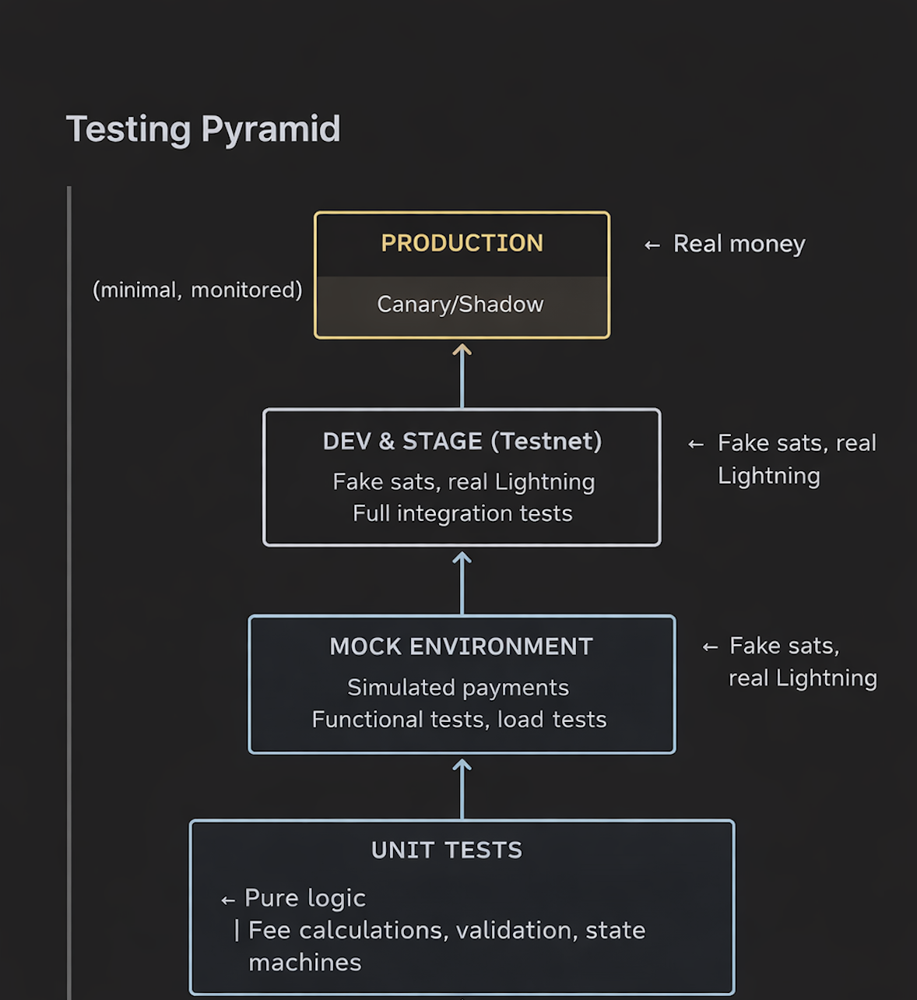

# Scenario 2: First QA Engineer at ZBD

## Introduction

I would be very excited about the opportunity to join ZBD as the first QA engineer. In my first 30 days, my primary focus would be **learning before changing**—understanding production defects, incidents, defect density trends, and how the company defines success for product quality over the next year.

In previous roles, including GitHub, I've seen new hires attempt to introduce major process changes within their first few weeks. Without first understanding existing workflows, culture, and constraints, these efforts often **reduced sprint velocity rather than improving quality**. My approach at ZBD would be to **work within the current workflow first**, establish a clear quality baseline, and then propose incremental improvements grounded in real data and team context.

---

## First 30-Day Plan: Assessing Gaps & Establishing Baselines

### Weeks 1–2: Discovery & Risk Mapping

- Meet with engineering, product, and support teams to understand current pain points
- Review system architecture (wallets, Lightning nodes, APIs, mobile flows)
- Audit existing test coverage and build a test inventory
- Analyze production incidents and outages from the past 3–6 months
- Identify highest-risk user flows: rewards, withdrawals, idempotency, fraud prevention

### Weeks 3–4: Stabilization & Quick Wins

- Add smoke tests for the most critical money-moving paths
- Introduce **balance invariants** and **idempotency checks**
- Integrate tests into CI for fast feedback on financial code paths
- Define bug severity standards and release quality gates
- Document test environments, assumptions, and expectations

### End-of-Month Deliverables

- Risk matrix (likelihood × impact)
- Baseline QA metrics (incident rate, defect density, meaningful coverage)
- 90-day QA roadmap aligned with engineering and product goals

---

## Balancing Speed vs. Coverage

### The Challenge

Fast-shipping teams can't wait for comprehensive test suites. The goal is **maximum risk reduction with minimum friction**.

### Tiered Testing Approach

| Tier | What Gets Tested | When | Coverage Target |
|------|------------------|------|-----------------|
| **Blocking** | Payment correctness, balance integrity | Every PR | 100% of money paths |
| **Required** | Core API contracts, auth flows | Every PR | 80% of critical paths |
| **Nightly** | Full regression, edge cases | Scheduled | Broad coverage |
| **Scheduled** | Load tests, security scans | Scheduled | Performance baselines |

### Principles

- **Block untested money code** — no exceptions for financial transactions on every PR
- **Parallelize everything else** — run extended tests when merging to dev & staging
- **Use feature flags** — easily decouple deploy from release for risky changes
- **Fast rollback capability** — monitor production, revert quickly if needed

**Philosophy:** Ship fast, but never ship untested money code.

---

## Testing Financial Transactions with Real Money

### Guiding Principle

**Never test with real money until you've exhausted every simulation option.**

### Production Safeguards

When testing with real money is unavoidable:

- Cap test transactions at small amounts (e.g., 100 sats)
- Use allow-listed test accounts only
- Real-time monitoring with instant alerts
- Automated rollback on any balance discrepancy
- Reconciliation within minutes, not hours

### What Never to Do

- Test with customer funds
- Skip testnet validation
- Disable safeguards "just for testing"
- Test large amounts in production

---

## Summary

| Area | Approach |
|------|----------|
| **30-Day Plan** | Learn first, stabilize, then improve. Deliver risk matrix + 90-day roadmap. |
| **Speed vs Coverage** | Tiered testing: block money code, parallelize the rest. |
| **Real Money Testing** | Pyramid approach: unit → mock → testnet → guarded production. |

---

## Related Documents

- [Test Plan](../TestPlanPRD/test-plan.md) - Overall testing strategy
- [LIGHTNING-TIMEOUT-BUG-ANALYSIS.md](./LIGHTNING-TIMEOUT-BUG-ANALYSIS.md) - Example production bug analysis
- [Automation Strategy](../automation-strategy.md) - Test automation approach
